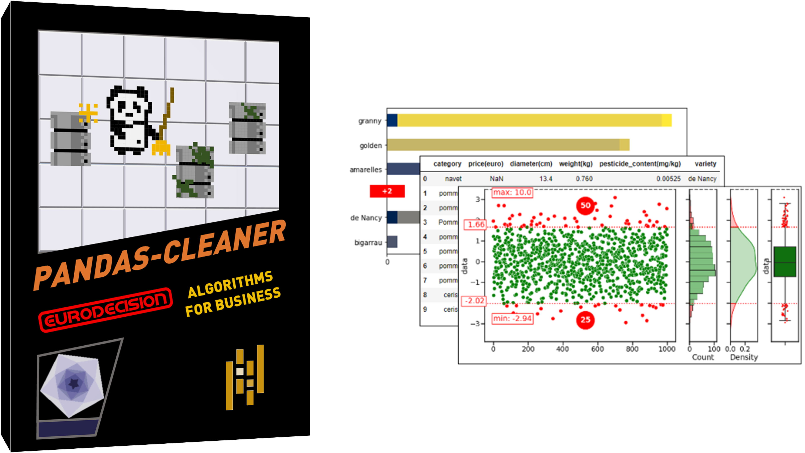

:notoc:

Pandas-cleaner's documentation
==============================

Pandas-cleaner is a Python library, built on top of pandas, to detect, analyze and clean errors in datasets with numerical and/or categorical features.

   
Pandas-cleaner offers functionnalities to automatically :

1. **detect** different kind of potential errors in datasets such as outliers, inconsistencies, typos, wrong-typed ..., given predefined rules or statistiscal estimations,  via an easy-to-use API extending pandas,

2. **analyze** these errors, via reports and plots, to check the validity of the set and/or decide if any correction is needed,

3. **clean** the datasets, either by dropping the lines with errors, emptying, correcting or replacing bad values,

4. **reapply** the same rules to any other incoming fresh data.

Example
-------

Import the package

.. code-block:: python

   import pandas as pd
   import pdcleaner

Create an example data series

.. code-block:: python

   series = pd.Series([1, 5, -6, 100, 10])

Detect the errors in the series with a given method (such as `bounded`, `iqr`, `zscore` and many more depending the type of data...)

.. code-block:: python

   detector = series.cleaner.detect('bounded', lower=0, upper=10)

Inspect the result:

.. code-block:: none

   detector.report()

.. code-block:: none

                                    Detection report                               
   ==============================================================================
   Method:                      bounded      Nb samples:                        5
   Date:                January 24,2022      Nb errors:                         2
   Time:                       16:06:08      Nb rows with NaN:                  0
   ------------------------------------------------------------------------------
   lower                              0      upper                             10
   inclusive                       both      sided                           both
   ==============================================================================

Check the potential errors that have been detected

.. code-block:: python

   detector.detected

.. parsed-literal::

    2     -6
    3    100
    dtype: int64

Clean the detected errors from the series using the chosen method among `drop`, `to_na`, `clip`
, `replace`...

.. code-block:: python

   series.cleaner.clean("drop", detector, inplace=True)
   series

.. parsed-literal::

    0      1
    1      5
    4     10
    dtype: int64

.. 
   mdinclude:: ../../README.md

.. toctree::
   :maxdepth: 3
   :hidden:

   user_guide/index
   reference/index
   contributing/index
   release/index

Project's home page
-------------------

You can visit the `project's home page <https://edgitlab.eurodecision.com/data/pandas-cleaner>`_.
