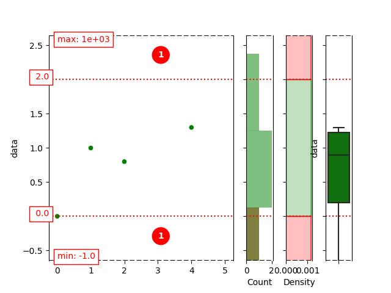

10 minutes to pandas-cleaner
============================

This is a short overview, for new users, of what you can do with pandas cleaner.
Much more detailed information can be found in the rest of the
documentation.

Once installed, pandas-cleaner is normally imported as follows:

.. code:: ipython3

    import pandas as pd
    import pdcleaner

The objective of the package is to extend pandas capabilities by
introducing methods to detect, analyze and clean potential errors in a dataset.

Let us see that in practice with a very simple series of numbers.

.. code:: ipython3

    series = pd.Series([0, 1, 0.8, 1e3, 1.3, -1])
    series

.. parsed-literal::

    0       0.0
    1       1.0
    2       0.8
    3    1000.0
    4       1.3
    5      -1.0
    dtype: float64

The value 1000 is obviously an outlier ! The negative value may be an
error or not depending the case.

With such simple and short series, it is very easy to spot potentially
problematic values. But imagine you have to deal with 1 millions rows,
this can not be done manually. Pandas clear offers functionnalities to do so
automatically.

Detection
---------

Let us say we know that every value must be positive and the maximum
possible value is 2. In order to detect errors, we can create a
so-called detector, based on our series and using the detection method
called ``bounded`` as follows:

.. code:: ipython3

    detector = series.cleaner.detect('bounded', lower=0., upper=2.)

.. note::

    In pandas cleaner, all detection method are called with the same API
    ``.cleaner.detect()`` applied to pandas series or dataframes.

An equivalent way of creating the detector is as follows, with the same keyword but as a method.

.. code:: ipython3

    detector = series.cleaner.detect.bounded(lower=0., upper=2.)

The second syntax allows to access the documentation and examples
related to the ``bounded`` method (with ``Shift+Tab`` in a notebook for
example).

Details on the arguments and examples are accessible via `help(series.cleaner.detect.bounded)` or in the API reference section of this doc.

.. note::
    Pandas cleaner offers a set of detection methods for different kind of
    quantitative and/or qualitative data:

    -  numerical series

    -  categorical series

    -  numerical series attached to different categories

    -  set of categories/sub-categories

    -  multivariate numerical dataframes

    A comprehensive list, along with the associated keywords, can be found
    in the API reference section of this documentation. 
    
    Examples of use for     the different types of data are given the next section of this user guide.

Analysis
--------

Once the detector created, many information can be retrevied about the
detected errors.

-  Are the any errors ?

.. code:: ipython3

    detector.has_errors()

.. parsed-literal::

    True

-  How many ?

.. code:: ipython3

    detector.n_errors

.. parsed-literal::

    2

-  Which are they ?

.. code:: ipython3

    detector.detected

.. parsed-literal::

    3    1000.0
    5      -1.0
    dtype: float64

-  Each row can easily be tagged as an error or not:

.. code:: ipython3

    detector.is_error()

.. parsed-literal::

    0    False
    1    False
    2    False
    3     True
    4    False
    5     True
    dtype: bool

- One can plot valid values, limits and number of errors detected above and below the limits

.. code:: ipython3

    detector.plot(compact=True)

.. note::
    Pandas-cleaner provides plotting utilities to visualize:

    -  Outliers in numerical series,

    -  Inconsistencies in categories/sub-categories associations,

    -  Multiple formatting for the classes in categorical series.

    Check the rest of the documentation, the user guide and the API
    reference for examples and details.

Cleaning
--------

Say we want to get rid of the detected errors to work with a clean dataset
(as an input of a machine learning model or for a BI dashboard…).

There are more than one way to clean the dataset, depending of the
objective. With pandas-cleaner, different methods can be used with the
same interface function ``cleaner.clean()``. Let us see two examples.

One can simply get rid of the lines with errors. To do so, the ``drop``
method is appropriate and  usable as follows :

.. code:: ipython3

    clean_series = series.cleaner.clean('drop', detector)
    clean_series

.. parsed-literal::

    0    0.0
    1    1.0
    2    0.8
    4    1.3
    dtype: float64

or, alternatively, just as for ``detect`` :

.. code:: ipython3

    clean_series = series.cleaner.clean.drop(detector)
    clean_series

.. parsed-literal::

    0    0.0
    1    1.0
    2    0.8
    4    1.3
    dtype: float64

The documentation is accessible via ``help(series.cleaner.clean.drop)``
or in the API reference section of this doc.

Consider now that you want to “clip” the errors, meaning all negative
values should be set to zero and all above above the maximum capped at
the maximum value. This is simply done with the clip method, that uses
lower and upper values that are attributes of the detector.

.. code:: ipython3

    print(f"min : {detector.lower}, max: {detector.upper}")

.. parsed-literal::

    min : 0.0, max: 2.0
    

.. code:: ipython3

    series.cleaner.clean('clip', detector)

.. parsed-literal::

    0    0.0
    1    1.0
    2    0.8
    3    2.0
    4    1.3
    5    0.0
    dtype: float64

.. note::
    The cleaning methods have an ``inplace`` option to overwrite the original data.

.. code:: ipython3

    series.cleaner.clean('clip', detector, inplace='True')
    series

.. parsed-literal::

    0    0.0
    1    1.0
    2    0.8
    3    2.0
    4    1.3
    5    0.0
    dtype: float64

.. note::

    Other cleaning methods are available:

    * ``replace`` to replace problematic cells by a value, or using a dict or a callable function
  
    * ``to_na`` to empty problematic cells and then use any missing-value imputation method
  
    * some other methods are specific to categorical detection methods, such as ``bykeys`` that is used along with ``keycollision`` detectors to identify typos or alternative formulations, e.g when `Linus Torvald` and `torvald, linus` should be same.

    See details along with examples in the user guide or the API reference.

Reapply to fresh data
---------------------

Say you have determined the min and max valid values on a set of 1M
rows. If the dataset is updated, you may not want/need to recalculate
the detector parameters, but simply apply them to clean a samaller set of
new rows.

This can for example be the case if the detector is part of an ETL
cleaning pipeline followed by the fitting of a machine learning model.
In this case, the detector has to be “fitted” on the train set, and then
applied as a tranformation step on the test set or, later, to new data during the
inference/prediction step.

To do so, pandas cleaner ``detect`` API method can be called with an
already "fitted" detector. For example, if we want to apply our bounded
detector to a new series:

.. code:: ipython3

    series2 = pd.Series([-1, 1, 235])

this can be done as follows:

.. code:: ipython3

    detector2 = series2.cleaner.detect(detector)

This detects the following problematic lines :

.. code:: ipython3

    detector2.detected

.. parsed-literal::

    0     -1
    2    235
    dtype: int64

Going further
-------------

The following sections in this user guide give more detailed examples to use pandas-cleaner with different kind of data.
