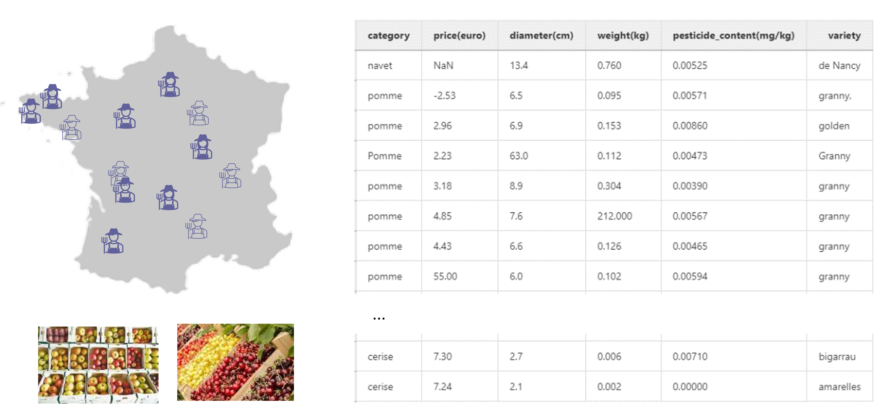

Example dataset
===============

In the set of tutorials in this user guide, we will be using a small
dataset representing the fruit stocks of different french farmers that
cultivate apples and cherries.

The farmers operate together as an agricultural business cooperative to
sell their product and therefore regularly update a common dataset in
which they indicate their ready-to-sell stocks of products.

Each entry of this common database figures the type of product, its
price, the average diameter of the fruits, their average weight, their
variety and their pesticide content.

.. note::

  In french, `pomme` means `apple` and `cerise` means `cherry`

.. warning::
  As this database is filled in by hand, it is prone to human errors and must be automatically checked.

The dataset is available as a csv file and can be downloaded as  :download:`Example data <./fruits_data.csv>`

.. code:: ipython3

    import pandas as pd
    data = pd.read_csv("fruits_data.csv", index_col=0)
    data.head(10)

.. raw:: html

    

    
    <table border="1" class="dataframe">
      <thead>
        <tr style="text-align: right;">
          <th></th>
          <th>category</th>
          <th>price(euro)</th>
          <th>diameter(cm)</th>
          <th>weight(kg)</th>
          <th>pesticide_content(mg/kg)</th>
          <th>variety</th>
        </tr>
      </thead>
      <tbody>
        <tr>
          <th>0</th>
          <td>navet</td>
          <td>NaN</td>
          <td>13.4</td>
          <td>0.760</td>
          <td>0.00525</td>
          <td>de Nancy</td>
        </tr>
        <tr>
          <th>1</th>
          <td>pomme</td>
          <td>-2.53</td>
          <td>6.5</td>
          <td>0.095</td>
          <td>0.00571</td>
          <td>granny,</td>
        </tr>
        <tr>
          <th>2</th>
          <td>pomme</td>
          <td>2.96</td>
          <td>6.9</td>
          <td>0.153</td>
          <td>0.00860</td>
          <td>golden</td>
        </tr>
        <tr>
          <th>3</th>
          <td>Pomme</td>
          <td>2.23</td>
          <td>63.0</td>
          <td>0.112</td>
          <td>0.00473</td>
          <td>Granny</td>
        </tr>
        <tr>
          <th>4</th>
          <td>pomme</td>
          <td>3.18</td>
          <td>8.9</td>
          <td>0.304</td>
          <td>0.00390</td>
          <td>granny</td>
        </tr>
        <tr>
          <th>5</th>
          <td>pomme</td>
          <td>4.85</td>
          <td>7.6</td>
          <td>212.000</td>
          <td>0.00567</td>
          <td>granny</td>
        </tr>
        <tr>
          <th>6</th>
          <td>pomme</td>
          <td>4.43</td>
          <td>6.6</td>
          <td>0.126</td>
          <td>0.00465</td>
          <td>granny</td>
        </tr>
        <tr>
          <th>7</th>
          <td>pomme</td>
          <td>55.00</td>
          <td>6.0</td>
          <td>0.102</td>
          <td>0.00594</td>
          <td>granny</td>
        </tr>
        <tr>
          <th>8</th>
          <td>cerise</td>
          <td>7.30</td>
          <td>2.7</td>
          <td>0.006</td>
          <td>0.00710</td>
          <td>bigarrau</td>
        </tr>
        <tr>
          <th>9</th>
          <td>cerise</td>
          <td>7.24</td>
          <td>2.1</td>
          <td>0.002</td>
          <td>0.00000</td>
          <td>amarelles</td>
        </tr>
      </tbody>
    </table>
    

Over these few first rows, we observe that there are multiple errors in
the dataset. For instance:

-  The first row, describes a turnip (navet in french) which is a vegetable
   and, therefore, should not be included in a dataset of fruits.

-  The second row, contains two errors:

   -  On one hand, the indicated price is negative.

   -  On the other hand, the variety contains a comma.

-  The fourth row, contains three errors:

   -  First, unlike other entries, “Pomme” is spelled with a capital p.

   -  Second, this row indicates an apple (une pomme) whose diameter is
      63cm which is clearly an error (maybe it was meant to be in mm).

   -  Finally, “Granny” starts with a capital letter unlike other
      entries of the variety column.

-  Row 6 describes a giant apple whose weight is 212 kg.

-  Row 8 indicates a price of 55€ for a kg of apples.

-  Finally, “bigarreaux” is missplled as “bigarrau” in row 9.

It is clear that even for such a small dataset, spotting and correcting
the errors is hard to do. So, one can only imagine how tedious it can be
when large datasets are involved.

